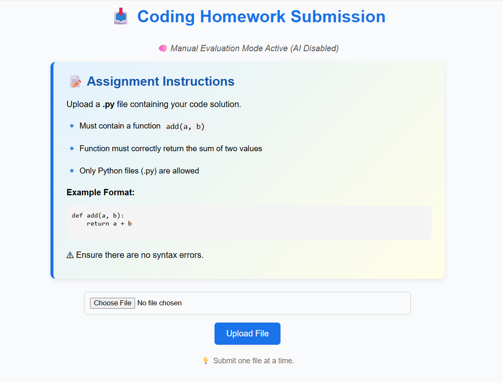
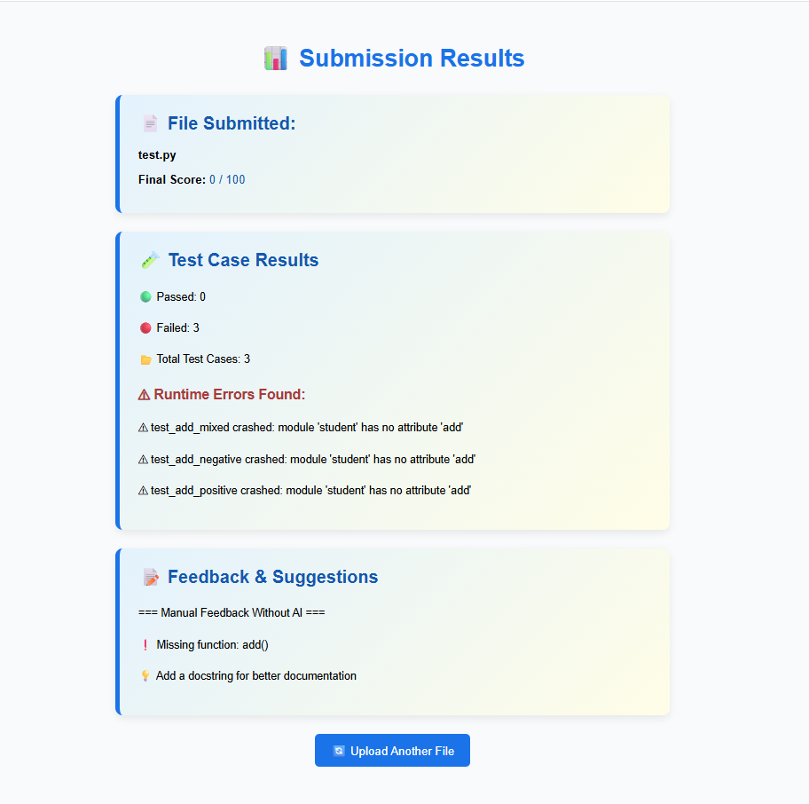

<h1 align="center">🚀 AI Homework Evaluator (Manual Mode)</h1>

  <b>A web app that checks student Python submissions, runs test cases, and generates feedback — even without an AI key.</b>
   
  Built with Flask · Dynamic Test Engine · Instant Feedback

<h2>📌 Overview</h2>

This project allows students to upload their <b>Python (.py)</b> code which is then evaluated based on predefined tests and rule-based logic.
It was previously integrated with OpenAI, and the AI feature remains commented in the code so you may reactivate anytime.  

<ul>
  <li>📁 Upload Python homework files</li>
  <li>🧪 Runs automated test cases</li>
  <li>📝 Generates feedback based on code quality</li>
  <li>⛔ No paid AI required (manual evaluation engine active)</li>
  <li>🔓 Future-ready — AI integration already included in comments</li>
</ul>

<h2>🛠 Tech Stack</h2>

<table>
<tr><td>⚙ Framework</td><td><b>Flask</b></td></tr>
<tr><td>📄 Language</td><td><b>Python 3.x</b></td></tr>
<tr><td>🎨 Frontend</td><td><b>HTML + CSS</b></td></tr>
<tr><td>🧪 Testing</td><td><b>Dynamic Python test cases</b></td></tr>
</table>

<h2>📂 Project Structure</h2>

<pre>
📦 project-folder
├── app.py                 # Main Flask backend
├── templates/
│   ├── index.html         # Upload UI
│   └── result.html        # Output + Feedback UI
├── static/
│   └── style.css          # Styling sheet
├── test_cases/
│   └── sample_tests.py    # Validation script
├── uploads/               # Auto-generated submissions folder
├── venv/                  # Virtual environment (ignored)
└── README.md
</pre>

<h2>⚙ Installation & Setup</h2>

<pre>
# Clone the repository
git clone https://github.com/your-username/your-repo.git
cd your-repo

# Create and activate virtual environment
python -m venv venv
source venv/bin/activate      (Linux/Mac)
venv\Scripts\activate         (Windows)

# Install requirements
pip install -r requirements.txt

# Run Flask app
python app.py
</pre>

Now open in your browser:

<pre>http://127.0.0.1:5000/</pre>

<h2>📥 Upload Flow</h2>

<ol>
  <li>Open web app</li>
  <li>Select a <code>.py</code> file and upload</li>
  <li>Auto test execution begins</li>
  <li>Get score, test status, and helpful feedback 🎉</li>
</ol>

<h2 id="screenshots">🖼 UI Preview (Screenshot Placeholder)</h2>

  <i>Add screenshots in this section using drag & drop on GitHub.</i>  
    
  

<h2>🔮 Future Upgrade Ideas</h2>

<ul>
  <li>Re-enable AI feedback using OpenAI or Gemini</li>
  <li>Allow multiple test files</li>
  <li>PDF feedback export</li>
  <li>Leaderboard for classroom usage</li>
</ul>

<h2>🤝 Contributing</h2>

Pull requests are welcome! For major changes, open an issue first to discuss what you'd like to modify.

<h2>📜 License</h2>

This project is open-source. Modify & improve freely.

<h3 align="center">Made with ❤️ for Learning & Evaluation</h3>
